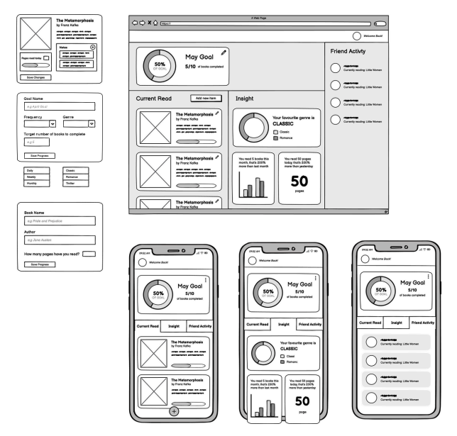
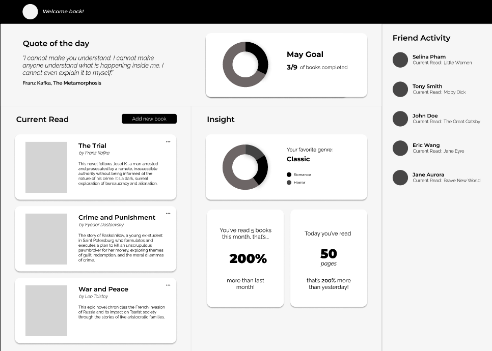
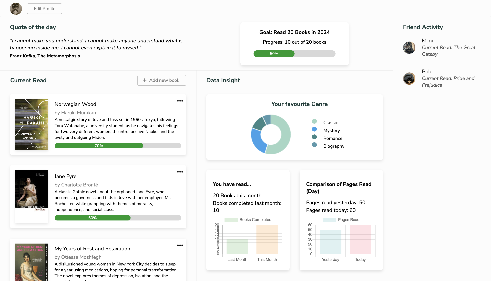
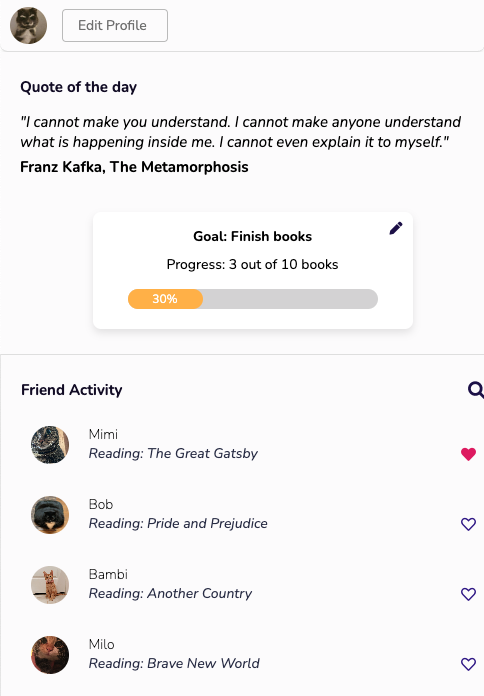
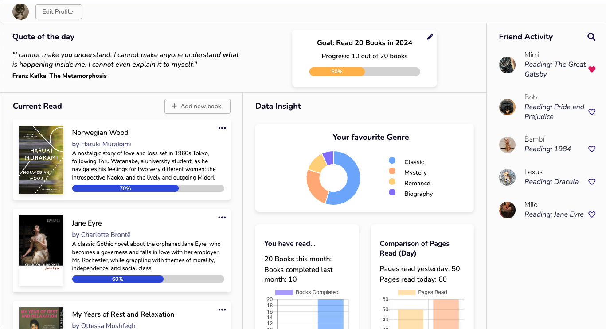
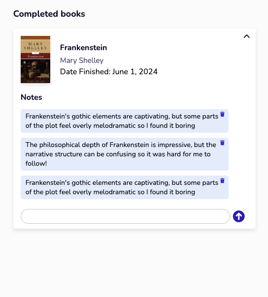

# 📚 Page Pal: Your Personal Reading Companion 📖

## Introduction

In today's era of constant digital distractions, maintaining a consistent reading habit has become increasingly challenging. Page Pal addresses this issue by offering users a personalized reading companion. With intuitive tools to track reading progress, set achievable goals, and share literary journeys with peers, Page Pal is designed to enhance the reading experience. As a book lover, I created this application to fulfill my needs for documenting book annotations and sharing my reading journey with fellow enthusiasts, which led to the ideation of Page Pal.

## Overview

Page Pal is tailored to young adults and working professionals proficient with technology, empowering them to improve their reading habits while fostering a sense of community and achievement.

## Features

- **Progress Tracking**: Users can track pages or chapters read, time spent reading, and book completion status.
- **Goal Setting**: Set personalized reading goals based on preferences, such as the number of books, pages, or reading challenges.
- **Achievement Recognition**: Earn achievements to encourage consistent engagement with reading materials.
- **Community Engagement**: Interact with friends through features like journaling and sharing reading progress.
- **Data Insights**: Gain insights into reading habits, preferences, and time spent reading.

## Technologies Used

- HTML5
- CSS3
- JavaScript (including libraries like Chart.js)
- localStorage for data storage

## Installation

To run Page Pal locally:

1. Clone this repository.
2. Navigate to the project directory.
3. Open `index.html` in your web browser.

### Website Deployment
You can access the deployed version of this website [here](https://pagepal.me/public/index.html).

## Usage

1. Set up reading goals in the "Goal" section.
2. Add new books to the reading list.
3. Track reading progress for each book in the "Current Read" section.
4. Edit or delete reading progress as needed.
5. Explore insights into reading habits in the "Data Insight" section.
6. Connect with friends and view their reading activity in the "Friend Activity" section.

## Contributing

Feel free to fork the repository to test or work on your own projects. Please note that direct contributions to this project are not accepted without prior permission.

## Development Process

### Mid-Fidelity Prototype

The mid-fidelity prototype includes four main sections: User Goal, Current Read, Data Insight, and Friend Activity. To enhance usability, pop-up tabs were introduced to streamline tasks like editing goals and tracking reading progress, it was fairly minimalist and I thought it had good readability.

### Mid-Iteration with Figma

Subsequently, during the mid-iteration phase using Figma, the prototype transitioned into a website. A "Quote of the Day" section was integrated alongside the user goal tab to encourage user engagement and increase knowledge sharing.

### Subsequent Iterations

Further refinements were implemented in this iterations, including the addition of a new section under "Data Insights" dedicated to book annotations. This phase involved lots of experimentation with colors and layout to refine the basic design. I also decide to make the website on smaller screens to have a scrolling flow similar to other single-page websites. This decision was influenced by the addition of new features and to enhance the overall aesthetic appeal.

### Final Iteration

In the final iteration, a cohesive color palette was applied to the design, along with additional functionalities such as pop-up error messages, form input placeholders, and the ability for users to add friends and offer them Kudos for reading progress. User is also able to save annotations of their completed books in the new Completed Books section.

### Reflections on Development and Future Enhancements
Overall, the process of developing this application involves lots of testing and experimentation, including aspects such as layout, design, colors, and functionalities. I believe I have executed a straightforward plan well, annotating my steps along the way with code comments to make management easier. However, given another opportunity, I would plan ahead for alternative applications, such as API or SQL integration, to enhance functionality of the application. Due to time constraints and the advanced stage of the finished product, further implementation is not possible. Overall, I am pleased with the iterations and the final outcome, the application looks more aesthetically pleasing, additional functions have been incorporated, and accessibility has been enhanced.

## Acknowledgements

- [Font Awesome](https://fontawesome.com/): for the icons.
- [Chart.js](https://www.chartjs.org/): for the data visualizations of bar charts and donut chart.
- [Styling Adaptation](https://codepen.io/FlorinPop17/pen/yLyzmLZ): Adapted code from Florin Pop's CodePen for the progress bar styling used in my Book Progress Tracking Tabs and User Goal Tab.

### AI Usage Acknowledgement
I used ChatGPT efficiently throughout the development process to fix bugs, restructure codes, organize codes, and write code comments, which significantly saved time and improved overall code quality.

### Version Control
The source code for this project is hosted on GitHub. You can find the repository [here](https://github.com/lhoa4904/lhoa4904.github.io).

## Image Reference
- Reddit. (n.d.). Photo of a cat with a squished face. Retrieved June 6, 2024, from https://i.redd.it/zwfggeplutf61.jpg

- Reddit. (n.d.). Photo of a cat that looks like a square pillow. Retrieved June 6, 2024, from https://preview.redd.it/this-cat-looks-like-a-square-pillow-v0-8qsgsnbxqj2b1.jpg?auto=webp&s=3c472c9001ad10b8b5faab0b613b1a221a002374

- Goodreads. (n.d.). Image of a book cover. Retrieved June 6, 2024, from https://images-na.ssl-images-amazon.com/images/S/compressed.photo.goodreads.com/books/1713542603i/11297.jpg

- Book Grocer. (n.d.). Image of a book cover. Retrieved June 6, 2024, from https://bookgrocer.com/cdn/shop/products/9780007350803.jpg?v=1640171404

- Goodreads. (n.d.). Image of a book cover. Retrieved June 6, 2024, from https://images-na.ssl-images-amazon.com/images/S/compressed.photo.goodreads.com/books/1597676656i/44279110.jpg

- The Last Word. (n.d.). Image of a book cover. Retrieved June 6, 2024, from https://d2j6dbq0eux0bg.cloudfront.net/images/62948299/2509798634.jpg

- Amazon. (n.d.). Image of a book cover. Retrieved June 6, 2024, from https://m.media-amazon.com/images/I/515zE1GxvAL._SY445_SX342_.jpg

- Reddit. (n.d.). Photo of a cat in a relaxed position. Retrieved June 6, 2024, from https://preview.redd.it/xyyi3hqby5581.jpg?width=1080&crop=smart&auto=webp&s=c6e7c38a06c442a10de1f68e93a04a6750d97058

- Reddit. (n.d.). Photo of a cat with a curious expression. Retrieved June 6, 2024, from https://external-preview.redd.it/kZdm7jcj4LgWS4H3BpoWcohu1ZJrPwPBk0T7s9Yew3M.jpg?auto=webp&s=825529a29ffc667d8f8c5cfa7a1d515b50c52e25

- Reddit. (n.d.). Photo of a cat named "Hope". Retrieved June 6, 2024, from https://preview.redd.it/reddit-meet-my-boy-hope-is-he-cute-v0-8hmjed7ux61a1.jpg?auto=webp&s=992a15701feb459e0309ab205cb7940660f85994